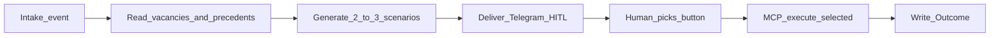

# AIDE — AI Decision Engine

Canonical definition: [PASSPORT.md](PASSPORT.md). Planes: [ARCHITECTURE.md](ARCHITECTURE.md).

## Definition

**AIDE** reads open vacancies + the tenant’s **Precedent Memory**, generates **2–3 action scenarios**, delivers them to the manager in Telegram as a HITL captcha, and after a human selection performs **only the selected** action through MCP under `tenant_id`, then writes the Outcome back to memory.

Formerly referred to as “Workflow Intake Agent.”

## Strict gate

“We have AI” is **false** unless all four hold:

1. Precedent context, or an explicit path to build it
2. Telegram HITL with **≥2** scenarios
3. Execution **only after** a human
4. Outcome record written to Precedent Memory

One Analyze + Chatbot = calculator, not AIDE.

## Ban

AIDE **never** auto-hires or auto-rejects. AI suggests; the human decides; MCP executes the choice.

## Lifecycle

| Step | Actor | Result |
|------|-------|--------|
| Intake | HireRank form / batch / HR upload | Event on broker; candidate in pool (`Unassigned`) |
| Context | AIDE | Vacancies + tenant Outcomes/precedents |
| Scenarios | AIDE + Ollama | 2–3 actions with rationale (assign, interview, archive/forward, …) |
| HITL | Manager via Telegram (n8n delivery) | One button chosen |
| Execute | FastMCP | DB change scoped to `tenant_id` |
| Memory | HireRank | Outcome → Precedent Memory |

## Artifact vs scoring ATS

| Measurement | Scoring ATS AI | HireRank AIDE |
|-------------|----------------|---------------|
| Job-to-be-done | Calculate fit | Pool → scenarios → action → memory |
| Artifact | Score / breakdown | 2–3 scenario buttons + precedent rationale |
| HITL UX | Weak web confirm | Telegram one-button captcha |
| Execution | Human clicks ATS UI | MCP after selection |
| Training | Static criteria | Precedent per selection + comment |
| Black box | Risk of autoScore | Banned |

## Inputs and outputs

**Inputs:** candidate questionnaire / resume event, open vacancies, Precedent Memory, optional management instructions.

**Outputs:** decision package (scenarios), pending HITL state, MCP action audit, Outcome record.

## See also

- Features: AIDE blocks in [FEATURESmd](FEATURESmd)
- Behavior: [use-cases/UC-08-aide-hitl-loop.md](use-cases/UC-08-aide-hitl-loop.md)
- API: scenarios / outcomes under [openapi/](openapi/)
