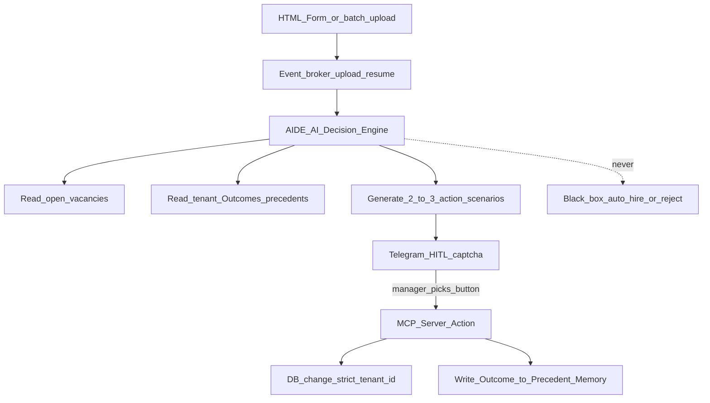

# HireRank — Architecture

Canonical product loop: [PASSPORT.md](PASSPORT.md). Engine detail: [AIDE.md](AIDE.md).

## Planes

| Plane | Role |
|-------|------|
| **HireRank** | Domain ATS: auth, RBAC, candidates, vacancies, pool, dashboards, storage |
| **AIDE** | AI Decision Engine: read vacancies + Precedent Memory → generate 2–3 scenarios (Ollama locally) |
| **FastMCP** | Executes **only** the human-selected action under `tenant_id`; writes Outcome back to memory |
| **n8n** | Delivery plane only: Telegram HITL, email, webhooks — **not** the decision engine |

```text
HireRank intake → event broker → AIDE → Telegram HITL (n8n) → human pick → FastMCP → DB + Precedent Memory
```

## Core flow



## Tenant boundary

- Every mutation and read is scoped by `tenant_id` (JWT claim + PostgreSQL RLS).
- **Hidden multi-tenancy (Core):** one seeded tenant per deploy (`TENANT_ID` env); register does not accept client `tenant_id`; FastAPI sets `SET LOCAL app.current_tenant` on each DB session.
- MCP tools refuse cross-tenant writes.
- Precedent Memory is a per-tenant asset; it leaves only with the client’s data.

## Stack (runtime)

| Area | Tech |
|------|------|
| HireRank app | Next.js, FastAPI, PostgreSQL, Redis, S3, Celery |
| AIDE | Ollama (local LLM) + decision/scenario orchestration |
| Execution | FastMCP under `tenant_id` |
| Delivery | n8n → Telegram / email / webhooks |
| Edge / ops | Traefik, Cloudflare, Compose |

## Security posture (summary)

No separate SECURITY.md. Controls live here, [GDPR.md](GDPR.md), and [RBAC.md](RBAC.md):

- On-prem custody of personal data and precedents
- RLS + `FORCE ROW LEVEL SECURITY` on tenant-scoped tables
- Bearer JWT (access + refresh); pluggable token store (`memory` Core default, `redis` for multi-replica / SaaS); tenant-prefixed keys
- Human-gated MCP (Art. 22 meaningful involvement)
- Audit trail: proposed scenarios → chosen button → MCP action → Outcome

## Non-goals

- Decision Maps / UDP as a separate product layer
- n8n as business-logic or DB-mutation owner
- Auto-disposition without a human button
