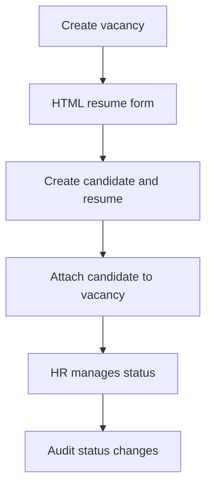

# HireRank — Architecture

Behavioral SoT: [use-cases/](use-cases/) (MVP: UC-01 through UC-07).
**Compliance (strict):** [ATS_COMPLIANCE_RK.md](laws/ATS_COMPLIANCE_RK.md) (RK — primary), [GDPR.md](laws/GDPR.md) (EU / West).
Vision: [PASSPORT.md](PASSPORT.md). Post-MVP LLM flow: [UC-08](use-cases/UC-08-automation-hitl-loop.md).
ATS tables + RLS map: [ATS_SCHEMA.md](ATS_SCHEMA.md).

## Planes

| Plane | Role |
|-------|------|
| **ATS MVP** | Auth, RBAC, candidates, vacancies, applications/pipeline, resume references, dashboards, and storage |
| **Future LLM** | Prompt-based resume analysis and explainable recommendations after HR requests it |
| **Delivery** | Web is the first product surface; Telegram and WhatsApp are later adapters |

```text
Vacancy → HTML resume form → candidate/resume record → vacancy attachment → HR status update
```

The MVP must remain useful without an LLM or external messaging service.

### Post-MVP AI boundary

An HR-defined prompt may produce a draft evaluation with evidence and up to
three recommendations. HR confirms the final action; the LLM cannot silently
change candidate status.

## Core MVP flow



## Tenant boundary

- Every mutation and read is scoped by `tenant_id` (JWT + PostgreSQL RLS).
- Core uses one seeded tenant per deploy (`TENANT_ID`).
- Future candidate evaluations must remain tenant-scoped.

## Stack (runtime)

| Area | Tech |
|------|------|
| HireRank app | Next.js, FastAPI, PostgreSQL, Redis, S3, Celery |
| **Future AI** | Local or approved LLM integration; not required for MVP |
| **Delivery** | Web MVP; Telegram/WhatsApp are future integrations |
| Edge / ops | Traefik, Cloudflare, Compose |

## Security posture (summary)

Controls: [GDPR.md](laws/GDPR.md), [RBAC.md](RBAC.md), and this document.

- on-prem custody of personal data;
- RLS and FORCE RLS on tenant-scoped tables;
- HttpOnly Secure cookie JWT session and CSRF protection;
- human confirmation for any future LLM recommendation;
- audit prompt, evidence, recommendation, final action, and actor.

## Non-goals

- MCP/event-driven bureaucracy automation as the MVP core
- n8n as business logic or database-mutation owner
- Automatic status changes without HR confirmation
- Separate Decision Maps or UDP product
