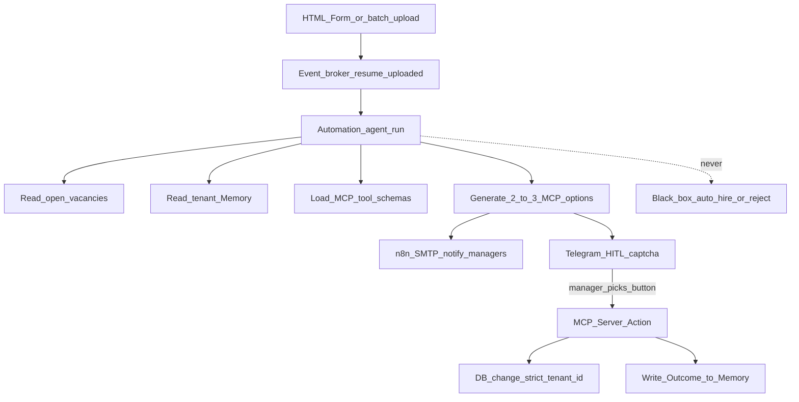

# HireRank — Architecture

Canonical product loop: [PASSPORT.md](PASSPORT.md). Automation detail: [AUTOMATION.md](AUTOMATION.md). Memory: [MEMORY.md](MEMORY.md).

## Planes

| Plane | Role |
|-------|------|
| **HireRank** | Domain ATS: auth, RBAC, candidates, vacancies, pool, dashboards, storage |
| **Automation** | Event-driven AI-native Automation + HITL: trigger → short-lived agent run → 2–3 MCP-backed options (local LLM) |
| **FastMCP** | Executes **only** the human-selected action under `tenant_id`; writes **Outcome** (option-choice history) into [Memory](MEMORY.md) |
| **n8n** | Delivery plane only: Telegram HITL, email, webhooks — **not** the automation brain |

```text
HireRank intake → event broker → Automation run → Telegram HITL (n8n) → human pick → FastMCP → DB + Memory (MEMORY.md)
```

### Why Automation ≠ Decision Engine

Automation is a **declarative definition** (prompt + tools + model + tenant scope) plus an **ephemeral agent run** per matching event. It is not a standing “AI Decision Engine” service that owns hiring outcomes. n8n delivers messages; FastMCP mutates data only after a human button. Durable decision history and run memory live in [Memory](MEMORY.md).

## Core flow



## Tenant boundary

- Every mutation and read is scoped by `tenant_id` (JWT claim + PostgreSQL RLS).
- **Hidden multi-tenancy (Core):** one seeded tenant per deploy (`TENANT_ID` env); register does not accept client `tenant_id`; FastAPI sets `SET LOCAL app.current_tenant` on each DB session.
- MCP tools refuse cross-tenant writes.
- [Memory](MEMORY.md) is a per-tenant asset (decision history + other run memory TBD); it leaves only with the client’s data.

## Stack (runtime)

| Area | Tech |
|------|------|
| HireRank app | Next.js, FastAPI, PostgreSQL, Redis, S3, Celery |
| Automation | Ollama (local LLM) + event worker / agent run orchestration |
| Memory | [MEMORY.md](MEMORY.md) — Outcome history + run memory; storage shape TBD |
| Execution | FastMCP under `tenant_id` |
| Delivery | n8n → Telegram / email / webhooks |
| Edge / ops | Traefik, Cloudflare, Compose |

## Security posture (summary)

No separate SECURITY.md. Controls live here, [GDPR.md](GDPR.md), and [RBAC.md](RBAC.md):

- On-prem custody of personal data and [Memory](MEMORY.md)
- RLS + `FORCE ROW LEVEL SECURITY` on tenant-scoped tables
- Bearer JWT (access + refresh); pluggable token store (`memory` Core default, `redis` for multi-replica / SaaS); tenant-prefixed keys — **not** product Memory
- Human-gated MCP (Art. 22 meaningful involvement)
- Audit trail: proposed options → chosen button → MCP action → Outcome in [Memory](MEMORY.md)

## Non-goals

- Decision Maps / UDP as a separate product layer
- n8n as business-logic or DB-mutation owner
- Auto-disposition without a human button
- Standing “decision engine” daemon that writes hiring outcomes without HITL
