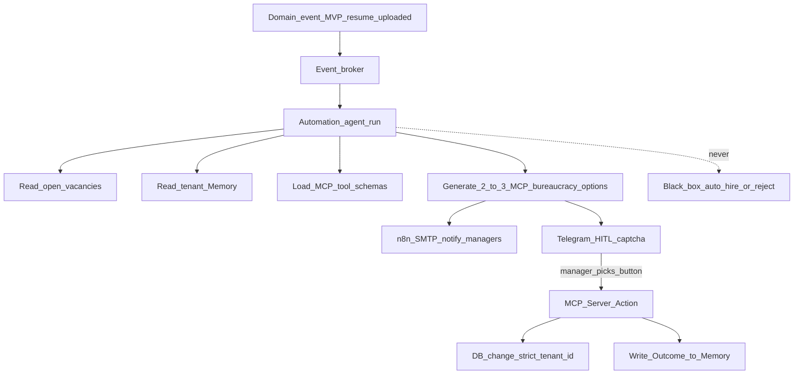

# HireRank — Architecture

Behavioral SoT: [use-cases/](use-cases/) ([UC-08](use-cases/UC-08-automation-hitl-loop.md)).
**Compliance (strict):** [ATS_COMPLIANCE_RK.md](ATS_COMPLIANCE_RK.md) (RK — primary), [GDPR.md](GDPR.md) (EU / West).
Vision: [PASSPORT.md](PASSPORT.md). Automation detail: [AUTOMATION.md](AUTOMATION.md). Memory: [MEMORY.md](MEMORY.md).

## Planes

| Plane | Role |
|-------|------|
| **HireRank** | Domain ATS: auth, RBAC, candidates, vacancies, pool, dashboards, storage |
| **Automation** | Event-driven bureaucracy Automation + HITL (implements UC-08): trigger → agent run → 2–3 MCP options |
| **FastMCP** | Executes **only** the human-selected tool under `tenant_id`; Outcome → [Memory](MEMORY.md) |
| **n8n** | Delivery: Telegram HITL, email — **not** the automation brain |

```text
Domain event → broker → Automation run → Telegram HITL (n8n) → human pick → FastMCP → DB + Memory (MEMORY.md)
```

**Moat:** AI Automation events with HITL via MCP tools, with Memory storing option-choice history — for bureaucracy; extensible beyond MVP `resume.uploaded` ([use-cases/README.md](use-cases/README.md)).

### Why Automation ≠ Decision Engine

Declarative Automation + ephemeral run per event. Not a standing decision daemon. n8n delivers; FastMCP mutates only after HITL. Durable choice history lives in [Memory](MEMORY.md).

## Core flow



## Tenant boundary

- Every mutation and read scoped by `tenant_id` (JWT + PostgreSQL RLS).
- **Hidden multi-tenancy (Core):** one seeded tenant per deploy (`TENANT_ID`); register ignores client `tenant_id`.
- MCP refuses cross-tenant writes.
- [Memory](MEMORY.md) is a per-tenant asset.

## Stack (runtime)

| Area | Tech |
|------|------|
| HireRank app | Next.js, FastAPI, PostgreSQL, Redis, S3, Celery |
| Automation | Ollama (local LLM) + event worker |
| Memory | [MEMORY.md](MEMORY.md) — Outcomes + run memory; storage TBD |
| Execution | FastMCP under `tenant_id` |
| Delivery | n8n → Telegram / email |
| Edge / ops | Traefik, Cloudflare, Compose |

## Security posture (summary)

Controls: here, [GDPR.md](GDPR.md), [RBAC.md](RBAC.md):

- On-prem custody of personal data and Memory
- RLS + FORCE RLS on tenant-scoped tables
- Bearer JWT; `TOKEN_STORE=memory|redis` — **not** product Memory
- Human-gated MCP (Art. 22); audit: options → button → MCP → Outcome in Memory

## Non-goals

- Decision Maps / UDP as a separate product layer
- n8n as business-logic or DB-mutation owner
- Auto-disposition without HITL
- Standing decision-engine daemon
