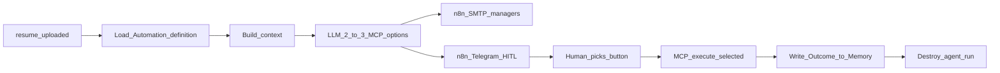

# HireRank Automation — Event-Driven AI-native Automation + HITL

Canonical definition: [PASSPORT.md](PASSPORT.md). Planes: [ARCHITECTURE.md](ARCHITECTURE.md). Behavior: [use-cases/UC-08-automation-hitl-loop.md](use-cases/UC-08-automation-hitl-loop.md). Memory: [MEMORY.md](MEMORY.md).

Formerly referred to as **AIDE** (AI Decision Engine). That name is retired; see [AIDE.md](AIDE.md) redirect.

## Definition

**HireRank Automation** (*ATS AI-native Automation*) is an **event-driven** plane: a declarative automation definition (prompt + model + allowed MCP tools + tenant scope) plus a **short-lived agent run** per matching event.

On `resume.uploaded`, the worker builds context (resume JSON, open vacancies, [Memory](MEMORY.md), MCP tool schemas), uses a **local self-hosted LLM** to propose **2–3 MCP-backed action options**, delivers them to managers via n8n (SMTP awareness + Telegram HITL captcha), and after a human selection executes **only the selected** tool through FastMCP under `tenant_id`, then writes the **Outcome** (history of that option choice) into [Memory](MEMORY.md). The agent run ends.

## Why Automation ≠ Decision Engine

| Decision Engine framing (retired) | HireRank Automation |
|-----------------------------------|---------------------|
| Permanent “brain” service that owns decisions | Declarative config; ephemeral run per event |
| Orchestration as a named AI product plane | Trigger → worker → options → HITL → MCP |
| Implies autonomous deciding | AI only suggests; human + MCP own the write |

Automation is config + a run, closer to an event-driven agent pattern than a standing decision daemon.

## Strict gate

“We have AI” is **false** unless all four hold:

1. [Memory](MEMORY.md) context, or an explicit path to build it
2. Telegram HITL with **≥2** MCP-backed options
3. Execution **only after** a human
4. Outcome (option-choice history) recorded in [Memory](MEMORY.md)

One Analyze + Chatbot = calculator, not HireRank Automation.

## Ban

Automation **never** auto-hires or auto-rejects. AI suggests; the human decides; MCP executes the choice. n8n is delivery only — it must not invent or execute domain mutations.

## Triggers (MVP)

| Event | Source | Status |
|-------|--------|--------|
| `resume.uploaded` | Candidate/HR intake (UC-01, UC-02) | MVP |
| Further domain events | TBD | Later |

## Lifecycle

| Step | Actor | Result |
|------|-------|--------|
| Event | HireRank form / HR upload | `resume.uploaded` on broker; candidate in pool (`Unassigned`) |
| Definition | Automation | Prompt + model + tools + tenant scope |
| Context | Automation worker | Resume JSON + vacancies + [Memory](MEMORY.md) + MCP schemas |
| Options | Worker + local LLM | 2–3 actions (tool + args + rationale) |
| Awareness | n8n SMTP | Managers notified of new resume |
| HITL | Manager via Telegram (n8n) | One button chosen |
| Execute | FastMCP | DB change scoped to `tenant_id` |
| Memory | HireRank | Outcome → [MEMORY.md](MEMORY.md) (decision history; other run memory TBD) |

## Artifact vs scoring ATS

| Measurement | Scoring ATS AI | HireRank Automation |
|-------------|----------------|---------------------|
| Job-to-be-done | Calculate fit | Pool → options → action → [Memory](MEMORY.md) |
| Artifact | Score / breakdown | 2–3 Telegram buttons + Memory rationale |
| HITL UX | Weak web confirm | Telegram one-button captcha |
| Execution | Human clicks ATS UI | MCP after selection |
| Training | Static criteria | Memory per selection + comment |
| Black box | Risk of autoScore | Banned |

## Inputs and outputs

**Inputs:** `resume.uploaded` payload, resume JSON, open vacancies, [Memory](MEMORY.md), automation prompt, allowed MCP tool schemas, optional management instructions.

**Outputs:** decision package (options), pending HITL state, MCP action audit, **Outcome** appended to [Memory](MEMORY.md).

## See also

- Memory: [MEMORY.md](MEMORY.md)
- Features: Automation blocks in [FEAUTERS.md](FEAUTERS.md) (F-020)
- Behavior: [use-cases/UC-08-automation-hitl-loop.md](use-cases/UC-08-automation-hitl-loop.md)
- API: packages / outcomes under [openapi/](openapi/) (`/automations/*`)
- Design reference (non-canon): [design/hitl_automation_pattern.md](design/hitl_automation_pattern.md)
