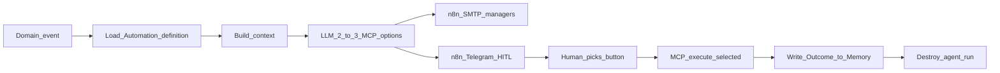

# HireRank Automation — Event-Driven AI-native Automation + HITL

**Implements** behavioral SoT: [use-cases/UC-08-automation-hitl-loop.md](use-cases/UC-08-automation-hitl-loop.md).
**Compliance (strict):** [ATS_COMPLIANCE_RK.md](ATS_COMPLIANCE_RK.md) (RK — primary), [GDPR.md](GDPR.md) (EU / West).
Index: [use-cases/README.md](use-cases/README.md). Planes: [ARCHITECTURE.md](ARCHITECTURE.md). Memory: [MEMORY.md](MEMORY.md). Vision: [PASSPORT.md](PASSPORT.md).

Formerly **AIDE** (retired).

## Definition

**HireRank Automation** automates hiring **bureaucracy** via AI Automation **events** with **HITL**: declarative config (prompt + model + allowed MCP tools + tenant scope) plus a **short-lived agent run** per matching event.

The LLM proposes **2–3 MCP-backed process options** (interview, assign, paperwork, …). A human picks one in Telegram. FastMCP executes **only** that tool under `tenant_id`. The **Outcome** (option-choice history) is written to [Memory](MEMORY.md). The agent run ends.

This is **not** a standing decision engine. Behavior must match UC-08; if this file conflicts with UC-08, fix this file.

## Moat (product)

Events + HITL + MCP + [MEMORY.md](MEMORY.md) option-choice history — for bureaucracy; same loop extends to further domain events beyond MVP. Detail: [use-cases/README.md](use-cases/README.md).

## Why Automation ≠ Decision Engine

| Decision Engine framing (retired) | HireRank Automation |
|-----------------------------------|---------------------|
| Permanent “brain” that owns decisions | Declarative config; ephemeral run per event |
| Autonomously decides hire/reject | Suggests bureaucracy options; human + MCP own the write |
| Single opaque service | Trigger → worker → options → HITL → MCP → Memory |

## Strict gate

Owned by **[UC-08 DoD](use-cases/UC-08-automation-hitl-loop.md)**:

1. Memory context, or path to build option-choice history
2. Telegram HITL with ≥2 MCP-backed options
3. Execution only after a human
4. Outcome recorded in Memory
5. No silent rank-score as product artifact

## Ban

Never auto-hire or auto-reject. n8n is delivery only.

## Triggers

| Event | Source | Status |
|-------|--------|--------|
| `resume.uploaded` | UC-01 / UC-02 | MVP |
| Further domain events (`vacancy.*`, `assignment.*`, …) | Future use-cases | Extensible — same HITL/MCP/Memory contract (UC-08 Notes) |

## Lifecycle

| Step | Actor | Result |
|------|-------|--------|
| Event | HireRank (MVP resume upload) | Event on broker; candidate in pool |
| Definition | Automation | Prompt + model + tools + tenant scope |
| Context | Worker | Domain payload + vacancies + Memory + MCP schemas |
| Options | Worker + local LLM | 2–3 bureaucracy steps (tool + args + rationale) |
| Awareness | n8n SMTP | Managers notified |
| HITL | Manager via Telegram | One button chosen |
| Execute | FastMCP | DB change under `tenant_id` |
| Memory | HireRank | Outcome → [MEMORY.md](MEMORY.md) |

## Artifact vs scoring ATS

| Measurement | Scoring ATS AI | HireRank Automation |
|-------------|----------------|---------------------|
| Job-to-be-done | Calculate fit | Bureaucracy: event → options → HITL → MCP → Memory |
| Artifact | Score | 2–3 Telegram buttons + Memory rationale |
| HITL UX | Weak web confirm | Telegram one-button captcha |
| Execution | ATS UI click | MCP after selection |
| Black box | Risk of autoScore | Banned |

## Inputs and outputs

**Inputs:** event payload (MVP resume JSON), vacancies, [Memory](MEMORY.md), automation prompt, MCP tool schemas.

**Outputs:** pending HITL package, MCP audit, Outcome in Memory.

## See also

- SoT: [UC-08](use-cases/UC-08-automation-hitl-loop.md)
- Memory: [MEMORY.md](MEMORY.md)
- Features: [FEAUTERS.md](FEAUTERS.md) F-020 (must match UC-08)
- Design reference (non-canon): [design/hitl_automation_pattern.md](design/hitl_automation_pattern.md)
