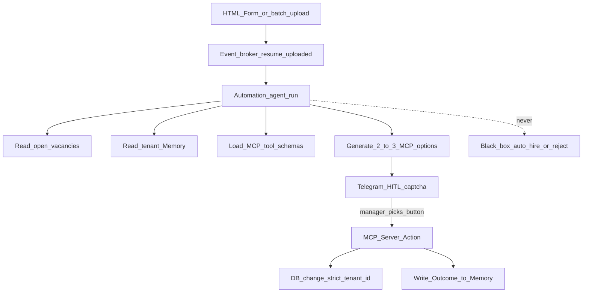

# HIRERANK — Product Vision & Goals

## The ATS for High-Volume Applicant Flow

**HIRERANK** — On-Premise ATS with **HireRank Automation** (*ATS AI-native Automation*): the organization's nervous hiring system, not a resume calculator. On `resume.uploaded`, Automation runs a short-lived agent, offers 2-3 MCP-backed options in Telegram (Human-in-the-Loop "captcha"), executes the selected action through a secure MCP under `tenant_id`, and accumulates **[Memory](MEMORY.md)** — decision history (Outcomes) and other run memory — a digital asset that does not get fired along with HR.

> **Pith (pitch):** HIRERANK + Automation is the organization's nervous system: we collect cases, preserve the experience of the best employees, and transform the management's text instructions into automatic *suggestions* for actions through Telegram and MCP. The agency / enterprise ceases to depend on the dismissal of key HRs — the logic of decisions becomes the tenant's asset.

> Architecturally and in meaning, **HIRERANK ≠ casual ATS AI** (scoring + chatbot like). See [How Automation Differs](#how-automation-differs-from-ats-today).

---

## Problem Statement

Major tech, manufacturing, and government organizations face three parallel crises in 2026-2030.

**Operational:** the flow of resumes is growing faster than the TA staff. Candidates are "hanging" in the mail and Excel, managers don't see people in time, and statuses are lost. A classic ATS is a base + pipeline, not a flood intake with a pool and instant manager ping.

**Regulatory and trust:** cloud-based ATS (Greenhouse, Workday, and similar) plus SaaS-AI make the employer a controller without a personal data perimeter and without provable human oversight. Government agencies are especially afraid of the **black box** that decides who to hire and who to reject.

**Institutional:** The hiring logic lives in the heads of key HRs. Firing = losing the process. Manual scoring rules and SOPs in Word are not trained by real department decisions.

### Cloud-based ATS vulnerabilities (2026–2030)

1. **Jurisdiction and data sovereignty** — CLOUD Act vs GDPR Art. 48 / national personal-data laws (e.g. 152-FZ); the controller is responsible, TIA/DPIA are complicated.
2. **AI as high-risk (EU AI Act Annex III §4)** — screening/evaluating candidates; deployer-responsibilities by ~December 2027; the vendor often has a black box with no audit trail for the buyer.
3. **GDPR Art. 22** — automatic filtering without meaningful human involvement.
4. **Per-seat + vendor lock-in** — price from seats; models and history from the vendor.
5. **CISO / CHRO / government customer fears** — personal data in other people's LLMs; bias claims; no continuity of knowledge with HR turnover.

### Problems for candidates and recruiters

| Hole | Essence | HIRERANK response |
|------|------|----------------|
| Invisibility through rank | Soft-reject without audit | No silent rank-graves; queue + HITL-buttons |
| Keyword feeds AI-slop | Stuffing beats matcher | Evidence + tenant [Memory](MEMORY.md), not denser score |
| Parser breaks format | Candidate "missing" | Fail-soft parse + flag to human |
| Auto-disposition (HiredScore / *Mobley v. Workday*) | Filter to human eye | Automation **only suggests**; human clicks button |
| Black-box fit | No "why" | Telegram: [Memory](MEMORY.md) + 2-3 options with rationale |
| AI in the recruiter's office | The manager doesn't see it | Telegram/email is the primary surface of the agent |
| No orchestration | Resume base ≠ process | Automation = event workflow + [Memory](MEMORY.md) |

---

## Will There Be a Moat?

**Yes.** Moat HIRERANK is not "just another LLM wrapper" or an ATS UI.

| Layer | What is accumulated | Why is it difficult for a competitor to copy it in a quarter? |
|------|-------------------|--------------------------------------------------|
| **[Memory](MEMORY.md)** | Tenant decision history (Outcomes: which option was chosen) + other Automation run memory | Associated with `tenant_id` and the actual practice of the agency/department; leaves with the client only along with their data |
| **Tenant decision graph** | Graph "candidate context → proposed actions → chosen outcome" | Each customer has its own specific requirements (university, software, related structure) — the vendor's universal model does not replace this |
| **HITL Telegram corpus** | Human-labeled outcomes on top of messages with buttons | Continuous training signal without a separate "label dataset" |
| **On-prem custody** | Data and [Memory](MEMORY.md) within the framework | Cloud SaaS cannot honestly offer the same sovereign asset |
| **Switching cost of the process** | Nervous system: instructions → suggestions → MCP actions | Moving = losing the digital asset of the hiring logic, not "exporting CSV" |

**HIRERANK** provides a repository of corporate hiring knowledge: with each candidate and each button in Telegram, the system gets smarter *inside the tenant*, maintaining full human control. This is Data Moat + Process Moat.

What **is not** moat in itself: a pretty chat UI, generic scoring criteria, or “we also do Telegram.”

---

## How Automation Differs from ATS Today

HIRERANK with **Automation** — **event-driven process automation with HITL**, not a standing decision engine.

### What is in ATS AI (not to be positioned as a HIRERANK hero)

| Outline | Behavior | Principle |
|--------|-----------|---------|
| **AI Scoring** | Analyze / optionally `autoScoreOnApply` → scores | Application score in dashboard |
| **Chatbot** | Flag off by default; Q&A read-tools | Conversation, not pipeline owner |

If a recruiter leaves, the **manual/generated criteria** and implicit logic go with them. Score itself does not become an asset of the organization.

### HireRank Automation (formerly "AIDE" / Workflow Intake Agent)

**Definition:** On `resume.uploaded`, Automation loads its definition, builds context (resume JSON + vacancies + [Memory](MEMORY.md) + MCP schemas), generates **2-3 MCP-backed action options**, delivers them to the manager in Telegram as a HITL-captcha (and notifies managers by email), and after selecting a person, performs **only the selected** action through MCP under `tenant_id` and writes the **Outcome** (option-choice history) into [Memory](MEMORY.md).

| Measurement | any ATS AI | HIRERANK Automation |
|-----------|----------------------|---------------------|
| **Job-to-be-done** | Calculate fit | Process management: pool → options → action → [Memory](MEMORY.md) |
| **Rules** | Admin sets / generates criteria under JD | Dynamics from **Outcomes** in [Memory](MEMORY.md) + management instructions |
| **Artifact** | Score / criterion breakdown | **2–3 option buttons** + rationale from [Memory](MEMORY.md) |
| **HITL UX** | Confirmation in web UI (weak) | Telegram captcha: select an option with one button |
| **Execution** | The person clicks on the ATS | **MCP action** after selection (assign, interview, archive/forward) |
| **Training** | Static criteria | [Memory](MEMORY.md) for each selection + comment |
| **Resistance to turnover** | Logic in the heads / manual rules | Logic is a digital asset `tenant_id` |
| **Black box** | Risk `autoScoreOnApply` | **Ban:** AI does not make final decisions |
| **Moat** | Weak (criteria are copied) | [Memory](MEMORY.md) corpus + process switching cost |

**Strict rule:** "we have AI" = false if there is no (1) [Memory](MEMORY.md) context or explicit path to it, (2) Telegram HITL with ≥2 options, (3) execution only after a human, (4) Outcome recorded in [Memory](MEMORY.md). One Analyze + Chatbot = calculator, not HireRank Automation.

---

## Unique Value Proposition (UVP)

### Five positioning theses

1. **Data never leaves your perimeter** — On-Prem; personal data and [Memory](MEMORY.md) stay in the loop.
2. **Automation co-pilot, not black box** — prepares options; a person presses a button; MCP writes only the selected data to the database.
3. **[Memory](MEMORY.md) = org asset** — Outcomes (option-choice history) and run memory; turnover does not reset the process.
4. **Built for the flood, not seats** — intake + Telegram on the platforms; the price is not based on the number of seats.
5. **Selective MCP execution** — only the human-chosen option runs under `tenant_id`; AI never auto-hires or auto-rejects.

---

## Doc index

| Doc | Purpose |
|-----|---------|
| [PRODUCT.md](PRODUCT.md) | Problem, UVP, JTBD, anti-patterns |
| [ARCHITECTURE.md](ARCHITECTURE.md) | HireRank / Automation / FastMCP / n8n planes |
| [AUTOMATION.md](AUTOMATION.md) | Event-driven Automation lifecycle + strict gate |
| [MEMORY.md](MEMORY.md) | Decision history (Outcomes) + other run memory |
| [AIDE.md](AIDE.md) | Deprecated name → redirect |
| [ROADMAP.md](ROADMAP.md) | Delivery phases |
| [FEAUTERS.md](FEAUTERS.md) | Feature catalog |
| [use-cases/](use-cases/) | Behavioral specs UC-01…UC-08 |
| [openapi/](openapi/) | REST API contract |
| [GDPR.md](GDPR.md) | Privacy, sovereignty, Art. 22 HITL |
