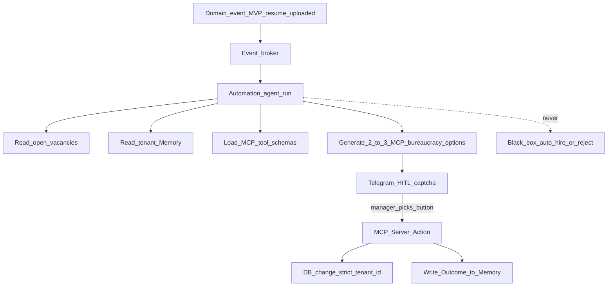

# HIRERANK — Product Vision & Goals

Behavioral Source of Truth: [use-cases/](use-cases/) (MVP: UC-01 through UC-07).
**Compliance (strict):** [ATS_COMPLIANCE_RK.md](laws/ATS_COMPLIANCE_RK.md) (RK — primary), [GDPR.md](laws/GDPR.md) (EU / West). See north star in [use-cases/README.md](use-cases/README.md).

## The ATS for High-Volume Applicant Flow

**HIRERANK** — an ATS for HR teams. The MVP manages vacancies, receives HTML
resume forms, attaches candidates to vacancies, and tracks the hiring pipeline.
Prompt-based LLM recommendations are post-MVP.

The MVP has no required event broker or LLM. After the ATS flow is stable,
[UC-08](use-cases/UC-08-automation-hitl-loop.md) adds resume analysis against
an HR prompt and human-confirmed recommendations.

> **Pith (pitch):** HIRERANK gives HR one place to create vacancies, collect
> resumes, attach candidates, and make traceable hiring decisions.

> Future AI supports HR with evidence-based recommendations; it does not
> replace the HR decision or the ATS workflow.

---

## Problem Statement

Major tech, manufacturing, and government organizations face three parallel crises in 2026

**Operational:** the flow of resumes is growing faster than the TA staff. Candidates are "hanging" in the mail and Excel, managers don't see people in time, and statuses are lost. A classic ATS is a base + pipeline, not a flood intake with a pool and instant manager ping.

**Regulatory and trust:** cloud-based ATS (Greenhouse, Workday, and similar) plus SaaS-AI make the employer a controller without a personal data perimeter and without provable human oversight. Government agencies are especially afraid of the **black box** that decides who to hire and who to reject.

**Institutional:** The hiring logic lives in the heads of key HRs. Firing = losing the process. Manual scoring rules and SOPs in Word are not trained by real department decisions.

### Cloud-based ATS vulnerabilities (2026)

1. **Jurisdiction and data sovereignty** — CLOUD Act vs GDPR Art. 48 / national personal-data laws (e.g. 152-FZ); the controller is responsible, TIA/DPIA are complicated.
2. **AI as high-risk (EU AI Act Annex III §4)** — screening/evaluating candidates; deployer-responsibilities by ~December 2027; the vendor often has a black box with no audit trail for the buyer.
3. **GDPR Art. 22** — automatic filtering without meaningful human involvement.
4. **Per-seat + vendor lock-in** — price from seats; models and history from the vendor.
5. **CISO / CHRO / government customer fears** — personal data in other people's LLMs; bias claims; no continuity of knowledge with HR turnover.

### Problems for candidates and recruiters

| Hole | Essence | HIRERANK response |
|------|------|----------------|
| Resume lost in mail or spreadsheets | Candidate disappears from the process | Vacancy attachment and visible pipeline |
| LLM recommendation without context | HR cannot verify the result | Prompt, evidence, rationale, and human confirmation |
| Parser breaks format | Candidate "missing" | Fail-soft parse + flag to human |
| Auto-disposition (HiredScore / *Mobley v. Workday*) | Filter to human eye | Automation **only suggests**; human clicks button |
| Black-box fit | No "why" | Future LLM output must include evidence and rationale |
| AI in the recruiter's office | The manager does not see it | Web is the first review surface |
| No workflow | Resume base is disconnected from vacancies | Candidate-to-vacancy pipeline |

---

## Product direction after MVP

The next product layer may add prompt-based LLM analysis. It is not required for
the ATS MVP and must remain subordinate to the vacancy and candidate workflow.

| Layer | What compounds | Why hard to copy quickly |
|------|----------------|--------------------------|
| **Events + HITL + MCP** | Domain events → 2–3 MCP-backed bureaucracy options → human pick → FastMCP under `tenant_id` | Process wired to tenant tools and policy, not a generic chat |
| **[Memory](MEMORY.md)** | Option-choice history (Outcomes) + other run memory | Tenant practice corpus; leaves only with the client’s data |
| **HITL corpus** | Human-labeled buttons on Telegram | Continuous training signal without a separate label dataset |
| **On-prem custody** | Data and Memory inside the perimeter | Cloud SaaS cannot honestly match sovereignty |
| **Switching cost** | Nervous system: instructions → suggestions → MCP → Memory | Moving = losing the digital hiring-bureaucracy asset, not “export CSV” |

What **is not** moat alone: pretty chat UI, generic scoring criteria, or “we also do Telegram.”

Behavioral detail: [UC-08](use-cases/UC-08-automation-hitl-loop.md).

---

## Post-MVP LLM direction

HireRank may analyze an attached resume against HR criteria and return up to
three explainable recommendations. See [UC-08](use-cases/UC-08-automation-hitl-loop.md).

### What is in ATS AI (not a HIRERANK hero)

| Outline | Behavior | Principle |
|--------|-----------|---------|
| **AI Scoring** | Analyze / optionally `autoScoreOnApply` → scores | Application score in dashboard |
| **Chatbot** | Flag off by default; Q&A read-tools | Conversation, not pipeline owner |

### HireRank Automation (implements UC-08)

**Definition (aligned with UC-08):** On a matching event (MVP `resume.uploaded`), Automation builds context (resume/vacancies + Memory + MCP schemas), proposes **2–3 MCP-backed bureaucracy options**, delivers HITL via Telegram (and SMTP awareness), executes **only** the human-selected tool under `tenant_id`, and writes the **Outcome** into [Memory](MEMORY.md). Future events reuse the same contract.

| Measurement | any ATS AI | HIRERANK Automation |
|-----------|----------------------|---------------------|
| **Job-to-be-done** | Calculate fit | Bureaucracy: event → options → HITL → MCP → Memory |
| **Rules** | Admin criteria under JD | Outcomes in Memory + management instructions |
| **Artifact** | Score / breakdown | **2–3 option buttons** + Memory rationale |
| **HITL UX** | Weak web confirm | Telegram one-button captcha |
| **Execution** | Human clicks ATS | **MCP** after selection |
| **Training** | Static criteria | Memory per selection + comment |
| **Black box** | Risk `autoScoreOnApply` | **Ban:** AI does not make final decisions |
| **Moat** | Weak | Events + HITL + MCP + Memory for bureaucracy |

**Strict rule:** owned by [UC-08](use-cases/UC-08-automation-hitl-loop.md) DoD — Memory path, ≥2 HITL options, human before MCP, Outcome in Memory, no silent score.

---

## Unique Value Proposition (UVP)

1. **Data never leaves your perimeter** — On-Prem; personal data and Memory stay in the loop.
2. **Automation co-pilot for bureaucracy, not black box** — MCP options; human button; MCP writes only the selection.
3. **[Memory](MEMORY.md) = org asset** — option-choice history survives turnover.
4. **Built for the flood, not seats** — intake events + Telegram HITL.
5. **Selective MCP execution** — only the human-chosen option; extensible to more events.

---

## Doc index

| Doc | Purpose |
|-----|---------|
| **[use-cases/](use-cases/)** | **Behavioral Source of Truth** (MVP: UC-01…UC-07) |
| **[ATS_COMPLIANCE_RK.md](laws/ATS_COMPLIANCE_RK.md)** | **RK law / ATS compliance — strict** |
| **[GDPR.md](laws/GDPR.md)** | **EU / West privacy and human oversight — strict** |
| [PRODUCT.md](PRODUCT.md) | Problem, UVP, JTBD, anti-patterns |
| [ARCHITECTURE.md](ARCHITECTURE.md) | MVP ATS planes and post-MVP boundary |
| [AUTOMATION.md](AUTOMATION.md) | Archived post-MVP design reference |
| [MEMORY.md](MEMORY.md) | Deferred evaluation-history concept |
| [ROADMAP.md](ROADMAP.md) | Delivery phases |
| [FEAUTERS.md](FEAUTERS.md) | Feature catalog (must match use-cases) |
| [openapi/](openapi/) | REST API contract |
